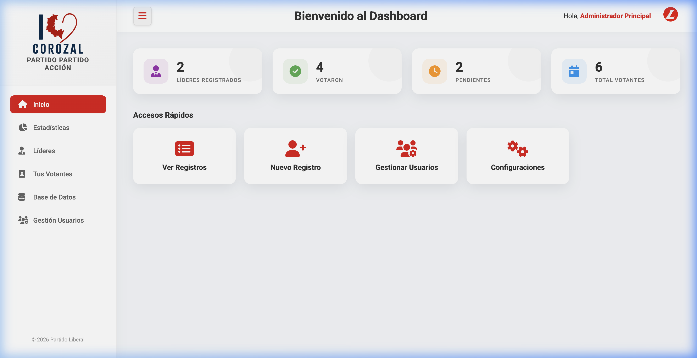
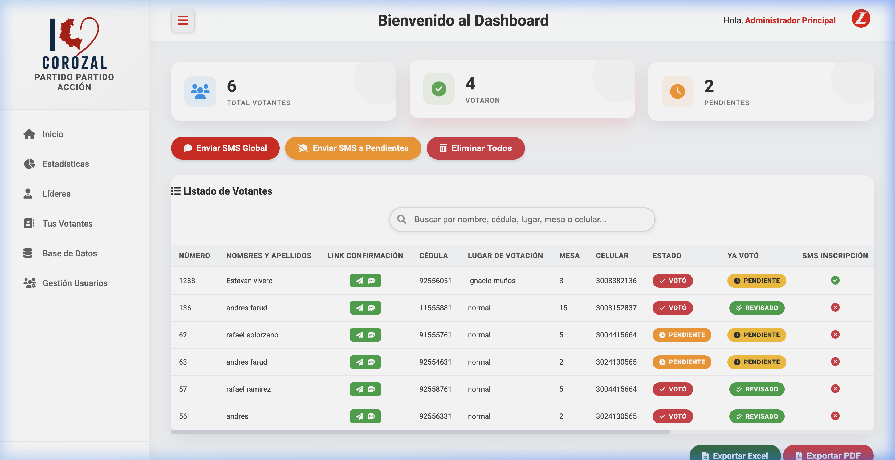
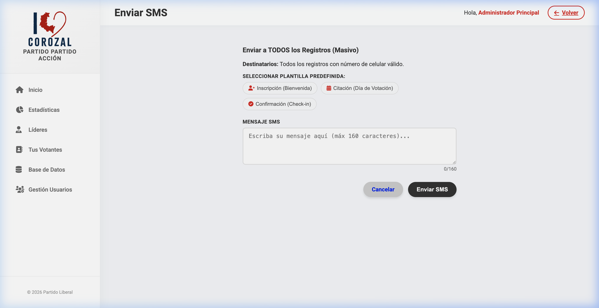
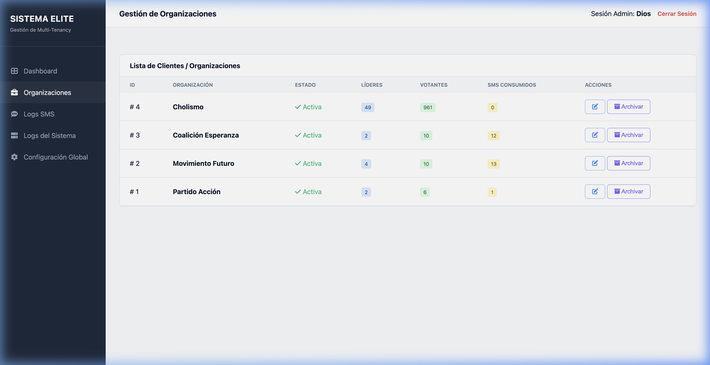

# 🗳️ Software Político SMS - Gestión Elite 🚀



## 📋 Descripción General
**Software Político SMS** es una plataforma integral de gestión electoral diseñada para optimizar la organización de líderes, el seguimiento de votantes y la comunicación masiva a través de SMS. Con una arquitectura **Multi-Tier (Multi-Tenancy)**, permite a múltiples organizaciones políticas gestionar sus campañas de manera independiente bajo una única infraestructura robusta.

Este sistema no solo facilita el registro y la geolocalización de votantes, sino que también ofrece herramientas de análisis en tiempo real para la toma de decisiones estratégicas basadas en datos.

---

## ✨ Características Principales

### 🏢 Arquitectura Multi-Tier (Multi-Tenancy)
*   **Gestión Centralizada:** Panel de "SISTEMA ELITE" para administrar múltiples organizaciones.
*   **Aislamiento de Datos:** Cada organización cuenta con su propia configuración, usuarios y base de datos de votantes.
*   **Personalización de Marca:** Logos, colores primarios y títulos adaptables por cada organización.

### 👥 Gestión de Líderes y Votantes
*   **Estructura Jerárquica:** Organización eficiente de líderes y sus respectivos grupos de votantes.
*   **Filtros Avanzados:** Búsqueda y segmentación por cédula, lugar de votación, mesa y celular.
*   **Estado de Voto:** Seguimiento detallado de quién ha votado, quién está pendiente y quién ha sido revisado.

### 📱 Comunicación Masiva SMS (Powered by Onurix)
*   **Campañas Segmentadas:** Envío de mensajes personalizados (Inscripción, Citación, Confirmación).
*   **Plantillas Inteligentes:** Gestión de plantillas para automatizar la comunicación.
*   **Confirmación via Link:** Generación de links únicos para confirmar la intención de voto.

### 📊 Dashboard y Estadísticas
*   **Métricas en Vivo:** Visualización de líderes registrados, total de votantes y estado de participación.
*   **Acceso Rápido:** Accesos directos a registro de votantes, gestión de usuarios y configuraciones.
*   **Reportes Exportables:** Exportación de datos a Excel y PDF para logística de campo.

---

## 📸 Capturas del Sistema

### Gestión de Votantes

*Listado detallado con gestión de estado de voto y envío de links de confirmación.*

### Centro de Envío de SMS

*Interfaz para envío masivo de SMS utilizando plantillas predefinidas.*

### Panel de Organizaciones (Superadmin)

*Control total sobre las diferentes organizaciones y su consumo de recursos.*

---

## 🛠️ Stack Tecnológico
*   **Backend:** PHP 7.4+ (PDO para seguridad SQL).
*   **Base de Datos:** MySQL / MariaDB.
*   **Frontend:** Custom CSS con diseño premium, FontAwesome y Chart.js.
*   **Integración SMS:** API Profesional de Onurix.
*   **Seguridad:** Control de sesiones, hashing de contraseñas y aislamiento multitenant.

---

## 🚀 Instalación y Configuración

1.  **Clonar el repositorio:**
    ```bash
    git clone https://github.com/D3C0D1/Software-Politico-SMS.git
    ```

2.  **Configuración de Base de Datos:**
    *   Importa el archivo `politica.sql`.
    *   Configura `mysql_creds.json` con tus credenciales locales.

3.  **Configuración de Onurix:**
    *   Ingresa al panel de configuración y añade tu `Client ID` y `API Key`.

---

## 🛡️ Niveles de Acceso
*   **Superadmin:** Gestión global del sistema y organizaciones.
*   **Admin:** Gestión total de una organización específica.
*   **Líder:** Gestión de su grupo asignado de votantes.

---
*Desarrollado para la eficiencia y transparencia en procesos electorales.*
